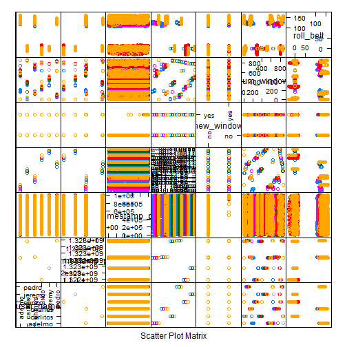
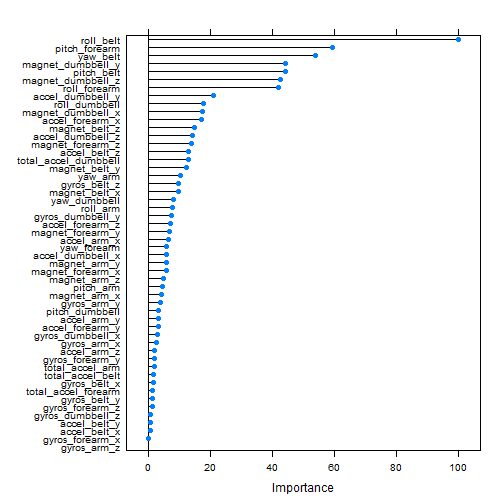

Practical Machine Learning - Project Summary
============================================

## Overview:
The project aims to predict the manner in which participants did "Weight Lifting Exercise".

## Processing
The first stage is loading the training dataset, spliting it to 2 subsets - one for creating the model and another subset for checking the accuracy of the model.

```r
library(caret)
setwd("D://docs//studying//Coursera//ML")
url <- "https://d396qusza40orc.cloudfront.net/predmachlearn/pml-training.csv"
#download.file(url,destfile="pml-training.csv") #no need to download the file when compiling the Knit, since it is already in the workspace
training <-read.csv("pml-training.csv",header=TRUE,na.strings = c("", "NA"))
sampleIndex <- createDataPartition(training$classe,times=1,p=0.75,list=FALSE)
sample <- training[sampleIndex,2:length(names(training))]

featurePlot(x=sample[,1:7],y=sample$classe,plot="pairs")
```

 

After some attempts to fit a good model and based on the course forum, i came into conclusion to remove the columns with have many missing values and those that are related to the way the experiment was made (all presented in the chart above).


```r
countNa <- sort(apply(training,2,function(column) {sum(is.na(column))}))
onlyColumnWithoutNa <- countNa[countNa ==0]
columnNames <- names(onlyColumnWithoutNa)
selectedColumns <- columnNames[8:length(columnNames)] # remove X and user name and other attributes that relate to the way the experiment made
sample.selectedColumns <- sample[,selectedColumns]
```
## Modeling

Fit a random forest model with cross validation of 10-fold. I have checked other approach such as boot632 and tried to also run a PCA, yet all the other approach yieled worst results

```r
rf_model_cv2<-train(classe~.,data=sample.selectedColumns,method="rf",trControl=trainControl(method="cv"),prox=TRUE)
```
### Model Details:

```r
rf_model_cv2
```

```
## Random Forest 
## 
## 14718 samples
##    52 predictor
##     5 classes: 'A', 'B', 'C', 'D', 'E' 
## 
## No pre-processing
## Resampling: Cross-Validated (10 fold) 
## 
## Summary of sample sizes: 13246, 13246, 13247, 13245, 13247, 13245, ... 
## 
## Resampling results across tuning parameters:
## 
##   mtry  Accuracy  Kappa   Accuracy SD  Kappa SD
##    2    0.9930    0.9911  0.001698     0.002147
##   27    0.9931    0.9913  0.001650     0.002088
##   52    0.9869    0.9834  0.003221     0.004076
## 
## Accuracy was used to select the optimal model using  the largest value.
## The final value used for the model was mtry = 27.
```

```r
plot(varImp(rf_model_cv2,type=2))
```

 

The model error rate and the confusion matrix for the 5 "classe"s:

```r
rf_model_cv2$finalModel
```

```
## 
## Call:
##  randomForest(x = x, y = y, mtry = param$mtry, proximity = TRUE) 
##                Type of random forest: classification
##                      Number of trees: 500
## No. of variables tried at each split: 27
## 
##         OOB estimate of  error rate: 0.6%
## Confusion matrix:
##      A    B    C    D    E class.error
## A 4182    1    0    0    2   0.0007168
## B   22 2819    7    0    0   0.0101826
## C    0    9 2551    7    0   0.0062330
## D    0    1   28 2381    2   0.0128524
## E    0    1    2    7 2696   0.0036955
```

Checking the model with the remaining part of the training data:

```r
traingTest <- training[-sampleIndex,]
traingTest.selectedColumns <- traingTest[,selectedColumns]
pred <- predict(rf_model_cv2,traingTest.selectedColumns)
confusionMatrix(traingTest.selectedColumns$classe,pred)
```

```
## Confusion Matrix and Statistics
## 
##           Reference
## Prediction    A    B    C    D    E
##          A 1394    1    0    0    0
##          B    4  944    1    0    0
##          C    0    1  852    2    0
##          D    0    0    5  798    1
##          E    0    0    1    3  897
## 
## Overall Statistics
##                                         
##                Accuracy : 0.996         
##                  95% CI : (0.994, 0.998)
##     No Information Rate : 0.285         
##     P-Value [Acc > NIR] : <2e-16        
##                                         
##                   Kappa : 0.995         
##  Mcnemar's Test P-Value : NA            
## 
## Statistics by Class:
## 
##                      Class: A Class: B Class: C Class: D Class: E
## Sensitivity             0.997    0.998    0.992    0.994    0.999
## Specificity             1.000    0.999    0.999    0.999    0.999
## Pos Pred Value          0.999    0.995    0.996    0.993    0.996
## Neg Pred Value          0.999    0.999    0.998    0.999    1.000
## Prevalence              0.285    0.193    0.175    0.164    0.183
## Detection Rate          0.284    0.192    0.174    0.163    0.183
## Detection Prevalence    0.284    0.194    0.174    0.164    0.184
## Balanced Accuracy       0.998    0.998    0.996    0.996    0.999
```

## Predicting the classe attribute of the testing data

```r
testFileName <-"pml-testing.csv"
testUrl <- "https://d396qusza40orc.cloudfront.net/predmachlearn/pml-testing.csv"
#download.file(testUrl,destfile=testFileName)
testing <-read.csv(testFileName,header=TRUE,na.strings = c("", "NA"))
selectedColumnsWithoutClasse <- selectedColumns[1:length(selectedColumns)-1]
testingData <- testing[,selectedColumnsWithoutClasse]
predTesting <- predict(rf_model_cv2,testingData)
```

The 20 predicted values:

```r
predTesting
```

```
##  [1] B A B A A E D B A A B C B A E E A B B B
## Levels: A B C D E
```

## Summary:
The random forest algorithm yields a high predication accuracy and a low error rate. The RF includes a cross validation check.
